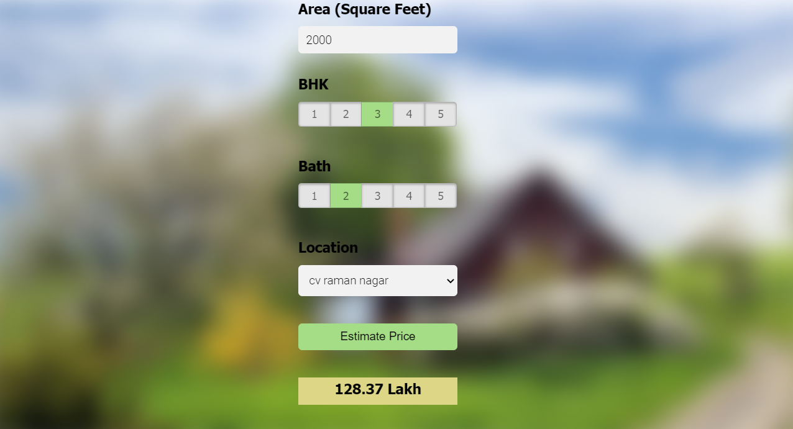

# Housing Price Predictor

In this data science and machine learning project, we implement Logistic regression using Bangalore's dataset to predict a continuous value of house prices by taking the features of house as input.

**Folder structure:**

- client : This contains UI website code
- server: Python flask server code
- model: Contains the generated model pickle file and column.json for data input format

**Technologies used in this project:**

1. Python
2. Numpy and Pandas for data cleaning
3. Matplotlib for data visualization
4. Sklearn for model building
5. Jupyter notebook, Visual Studio Code and PyCharm as IDE
6. Python flask for http server
7. HTML/CSS/Javascript for UI

**Required libraries**: NumPy, Pandas, Matplotlib, Flask, Scikit learn, Pickle, JSON

## How to use the model to make predictions?

1. Run the code present in Jupyter notebook "Model_generator.ipynb".
2. Navigate to 'server' folder and run "server.py" using any Python compiler
3. Navigate to 'client' folder and open "app.html" with any Web Browser. This opens the GUI.
4. In the website, enter the Area(in Square feet), Number of bedrooms(BHK),Number of Bathrooms, and a location in the Bangalore City.
5. The Estimated Price of the house in the selected locality in lakhs will be displayed in the website.

## GUI Snapshot

  
